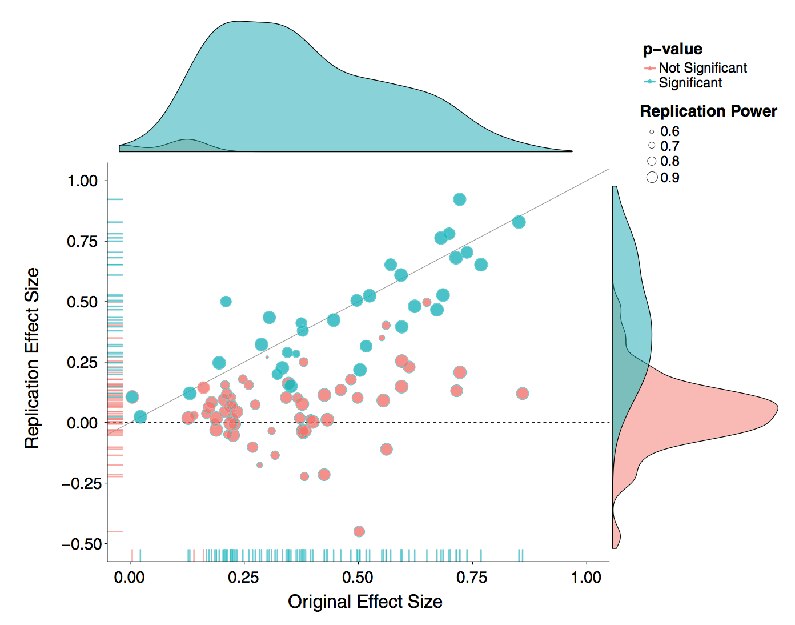

# Lecture 2: Reproducible Research, Markdown, Git and GitHub

**Trevor Bedford ([@trvrb](https://twitter.com/trvrb), [bedford.io](https://bedford.io))**

## Learning objectives

- Identify minimum requirements for a reproducible computational project
- Apply basic tasks using Git and GitHub to track versions of files
- Write formatted text files using Markdown

## Class materials

1. [Reproducibility and collaborative science](#reproducible-science)
2. [Markdown](#markdown)
3. [Git and GitHub](#git-and-github)

## Reminders

- Recommended reading is available at the end of each section
- Your first homework assignment is available today, and due Tuesday, October 8 at noon. You should receive an email containing an invitation to create your repository using GitHub Classroom. Please note that this homework covers project organization and Git/GitHub (lectures 1 and 2) as well as tidy data (lecture 3). Contact Kate (khertwec at fredhutch.org) with any questions or concerns.

## Reproducible science

### Motivation

There is a lot of interest and discussion of the reproducibility "crisis". In one example, ["Estimating the reproducibility of psychological science" (Open Science Collaboration, Science 2015)](https://doi.org/10.1126/science.aac4716), authors attempt to replicate 100 studies in psychology and find that only 36 of the studies had statistically significant results.

The Center for Open Science has also embarked on a [Reproducibility Project for Cancer Biology, with results being reported in an ongoing fashion](https://elifesciences.org/collections/9b1e83d1/reproducibility-project-cancer-biology).

There are a lot of factors at play here, including "_p_ hacking" lead by the "garden of forking paths" and selective publication of significant results. I would call this a crisis of _replication_ and have this as a separate concept from _reproducibility_.

Reproducibility is also difficult to achieve. In ["An empirical analysis of journal policy effectiveness for computational reproducibility" (Stodden et al, PNAS 2018)](https://doi.org/10.1073/pnas.1708290115), Stodden, Seiler and Ma:

>Evaluate the effectiveness of journal policy that requires the data and code necessary for reproducibility be made available postpublication by the authors upon request. We assess the effectiveness of such a policy by (i) requesting data and code from authors and (ii) attempting replication of the published findings. We chose a random sample of 204 scientific papers published in the journal Science after the implementation of their policy in February 2011. We found that we were able to obtain artifacts from 44% of our sample and were able to reproduce the findings for 26%.

They get responses like:

>"When you approach a PI for the source codes and raw data, you better
explain who you are, whom you work for, why you need the data and
what you are going to do with it."

>"I have to say that this is a very unusual request without any explanation!
Please ask your supervisor to send me an email with a detailed,
and I mean detailed, explanation."

[_Tables in paper are very informative._](http://www.pnas.org/content/pnas/115/11/2584.full.pdf)

At the _very_ least, it should be possible to take the raw data that forms the the basis of a paper and run the same analysis that the author used and confirm that it generates the same results. This is my bar for reproducibility.

### Reproducible science guidelines

My number one suggestion for reproducible research is to have:

**_One paper = One GitHub repo_**

Put both data and code into this repository. This should be all someone needs to reproduce your results.

_Digression to demo GitHub._

This has a few added benefits:

1. Versioning data and code through GitHub allows you to _collaborate_ with colleagues on code. It's extremely difficult to work on the same computational project otherwise. Even Dropbox is messy.

2. You're always working with future you. Having a single clean repo with documented readme makes it possible to come back to a project years later and actually get something done.

3. Other people can build off your work and we make science a better place.

I have a couple examples to look at here:

* My 2015 paper on global migration of influenza viruses: [github.com/blab/global-migration](https://github.com/blab/global-migration)
* [Sidney Bell's](https://bedford.io/team/sidney-bell/) 2018 paper on dengue evolutionary dynamics: [github.com/blab/dengue-antigenic-dynamics](https://github.com/blab/dengue-antigenic-dynamics)

Some things to notice:
* There is a top-level `README.md` (written in Markdown... more to come) file that describes what the thing is, provides authors, provides a citation and link to the paper and gives an overview of project organization.
* There is a top-level `data/` directory.
* Each directory should have a `README.md` file describing its contents.
* The readme files should specify commands to run, or point to the make file that does.
* Versioned Jupyter notebooks ([example](https://github.com/blab/dengue-antigenic-dynamics/blob/master/figures/titer-tree-heatmap.ipynb)) are viewable in the browser, as are `.tsv` files ([example](https://github.com/blab/dengue-antigenic-dynamics/blob/master/data/titers_katzelnick2015/dengue_titers.tsv)).
* Relative links throughout.
* Include language-specific dependency install file, Python uses `requirements.txt` as standard.
* Figures are embedded directly in the readme files via Markdown ([example](https://github.com/blab/global-migration/tree/master/geo)).

More sophisticated examples will use a workflow manager like Snakemake to automate builds. For example:

* Alistair Russell and Jesse Bloom's recent work on single-cell sequencing of influenza: [github.com/jbloomlab/IFNsorted_flu_single_cell/](https://github.com/jbloomlab/IFNsorted_flu_single_cell/)

With GitHub as lingua franca for reproducible research, there are now services built on top of this model. For example:

* [Zenodo](https://zenodo.org/) allows you to mint DOIs from GitHub releases.
* In [github.com/cboettig/noise-phenomena](https://github.com/cboettig/noise-phenomena), Carl Boettiger provides `.Rmd` of code, but also uses [Binder](https://mybinder.org/) to launch an interactive RStudio session. Binder is described in more detail [here](https://elifesciences.org/labs/a7d53a88/toward-publishing-reproducible-computation-with-binder).
* We've built [Nextstrain](https://nextstrain.org) to look for results files in public GitHub repos to provide interactive figures. For example [nextstrain.org/community/blab/zika-colombia](https://nextstrain.org/community/blab/zika-colombia) provides an interactive visualization of Allison Black's paper on [Zika in Colombia](https://bedford.io/papers/black-zika-in-colombia/).

### Project communication

For me, as PI, I enforce a further rule:

**_One paper = One GitHub repo = One Slack channel_**

It's _much_ easier if all project communication goes in one place.

### Further reading

Some suggested readings on reproducible research include:

* [Excellent advice from Karl Broman on initial steps to reproducible research](https://kbroman.org/steps2rr/)

## Markdown

* What is Markdown? ([Look at this lecture!](https://raw.githubusercontent.com/fredhutchio/tfcb_2019/master/lectures/lecture02/README.md))

* Invented by John Gruber to provide markup that is intuitive and aesthetically pleasing when viewed as plain text. It's similar to how you would style a plain text email.

* Check out this [Markdown cheatsheet](https://github.com/adam-p/markdown-here/wiki/Markdown-Cheatsheet). Also, [GitHub's Markdown style guide](https://guides.github.com/features/mastering-markdown/.)

* Markdown is well supported by GitHub. Because Markdown is plain text it versions well. Word docs version _horribly_.

* I strongly support its separation of content and styling.

* Some further examples of Markdown:
  - [Practical I wrote on using BEAST](https://github.com/trvrb/dynamics-practical)
  - [Benchtop protocol for Zika sequencing written by Alli](https://github.com/blab/zika-seq/tree/master/protocols)
  - bedford.io is written completely in Markdown ([example](https://github.com/blab/blotter/blob/master/blog/_posts/2019-09-26-sep-2019-nextflu-report.md))

## Git and GitHub

* Why use version control?

* Introduction to Git and distributed version control: [Basics from Alice Bartlett with Git for Humans](https://speakerdeck.com/alicebartlett/git-for-humans)

* Introduction to GitHub

* GitHub Desktop vs command line

* Demonstration:
  - Make a new project on GitHub
  - Make a linear series of commits in GitHub Desktop
  - Cover same actions on the command line: `git status`, `git add`, `git commit`, `git diff`
  - Safely exploring history and rolling back if necessary
  - Amend last commit  
  - Remotes and push and pull from GitHub  
  - Look at files under the hood

* Other details:
  - The importance of `.gitignore`
  - The importance of good commit messages, relevant [xkcd](https://xkcd.com/1296/)
  - Breaking up work and staging / committing different pieces separately

### Further reading

* [The Git parable by Tom Preston-Werner motivates many decisions made by Git](http://tom.preston-werner.com/2009/05/19/the-git-parable.html)
* [More by Karl Broman](https://kbroman.org/github_tutorial/)
* [A deeper guide to Git](https://matthew-brett.github.io/curious-git/index.html)
