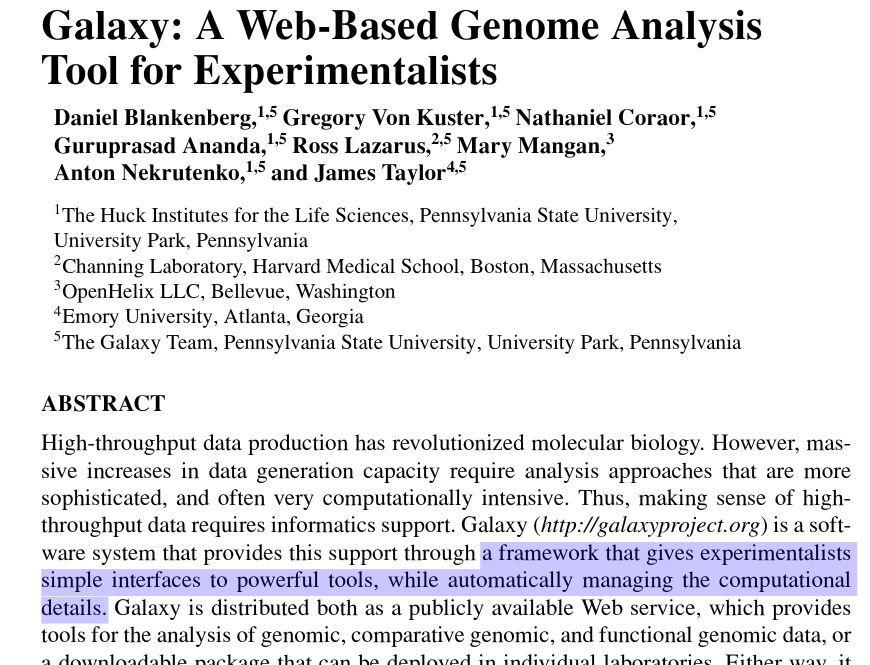

# all high-performance compute systems run linux

#
<section data-background="https://img-en.fs.com/community/wp-content/uploads/2016/08/Data-Center-.jpg"></section>

#
<section data-background="images/gizmo.png"></section>

#

#

#

#

#
<section data-background="images/processor.jpg"></section>

#
<section data-background="https://i.imgur.com/PZ4yN4V.jpg"></section>

#
<section data-background="images/harvesters.jpg"></section>

# goals

* rudiments of running a command in shell
* how to run a command in parallel across cores
